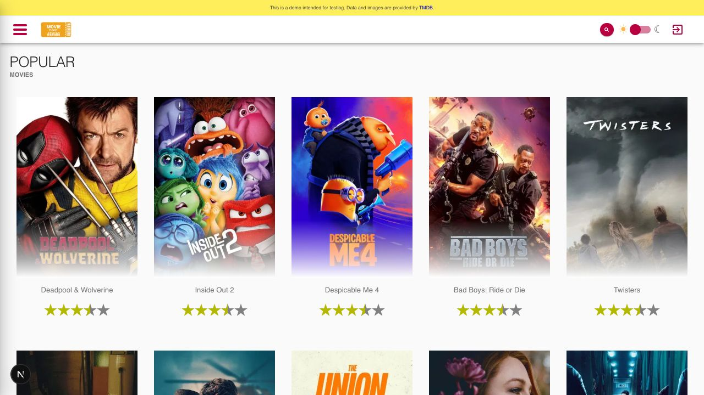

# Playwright Movies App

This repository provides a comprehensive guide to writing end-to-end tests with [Playwright](https://playwright.dev/), covering a wide range of scenarios to ensure your application is robust and reliable. Learn how to write tests for Authentication, Search, Sorting, API and API mocking, ARIA snapshots, and more.

The source code is a demo Movies App built with Next.js and React. Movie data and login come from the local **TMDB mock API** in [`mock-api/`](mock-api/) (no Azure account required). Images are still served from [The Movie Database (TMDB)](https://www.themoviedb.org/). This project is a fork of [next-movies](https://github.com/tastejs/next-movies) and has been customized for Playwright learning.



## Installation

Clone the repository and then install the dependencies:

```bash
git clone https://github.com/debs-obrien/playwright-movies-app.git
cd playwright-movies-app
npm install
```

`npm install` also builds the mock API.

## Environment Setup for Login Tests

Copy `.env.example` to `.env`. The mock accepts any username and password:

```bash
cp .env.example .env
```

## Running the app locally

Make sure ports **3000** (Next.js) and **4000** (mock API) are available.

* `npm run dev` — starts the mock API and the Movies app together
* `npm run mock` — mock API only (after `npm run mock:build`)
* `npm run build` / `npm run start` — production Movies app build

The app talks to `NEXT_PUBLIC_TMDB_API_BASE_URL` (default `http://127.0.0.1:4000`).

### Deploying the mock API (Cloudflare Workers)

Production for the GitHub Pages demo uses Cloudflare Workers (free tier). From `mock-api/`:

```bash
npx wrangler login
npm run deploy
```

See [`mock-api/README.md`](mock-api/README.md) for CI secrets and updating the Pages build URL.

## Running Tests

```bash
npx playwright test --ui
```

Playwright starts both the mock API and the app via `npm run dev`. You can also run tests with the [Playwright VS Code extension](https://marketplace.visualstudio.com/items?itemName=ms-playwright.playwright).

## Wiki

Check out the [wiki](https://github.com/debs-obrien/playwright-movies-app/wiki) for more info on the contents of each folder.

## License

[MIT](https://choosealicense.com/licenses/mit/)
