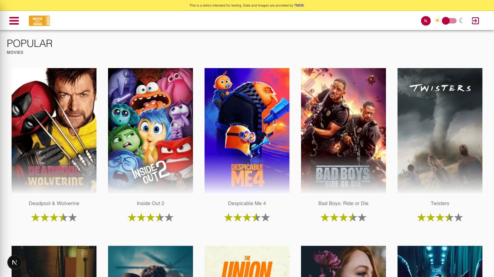

# Playwright Movies App

Hands-on guide to end-to-end testing with [Playwright](https://playwright.dev/) on a demo Movies app (Next.js). Covers authentication, search, sorting, API and network mocking, ARIA snapshots, fixtures/helpers, an optional Page Object example, and **AI-assisted** workflows — taken from a **coding agent**, not an IDE Testing UI or Codegen.

Movie data and login come from the local **TMDB mock API** in [`mock-api/`](mock-api/) (no cloud account required for login). Images may still load from [TMDB](https://www.themoviedb.org/). Fork of [next-movies](https://github.com/tastejs/next-movies), customized for learning.

## Start here

1. Clone, `npm install`, `npx playwright install chromium`, copy `.env.example` → `.env`.
2. Open this repo in **Cursor, Claude Code, Codex, or similar** (optional).
3. Read the [learn site](https://debs-obrien.github.io/playwright-movies-app/learn/) or open [`learn/00-start-here.md`](learn/00-start-here.md) in the repo.

| Resource | Path |
|----------|------|
| **Course** | [`learn/`](learn/index.md) · [published site](https://debs-obrien.github.io/playwright-movies-app/learn/) |
| **Live demo app** | [Movies app](https://debs-obrien.github.io/playwright-movies-app/) |
| **Skills** | `.agents/skills/movies-playwright`, `learn-lab-coach` (+ official `playwright-cli`, `playwright-trace`) |
| **Reference** | [`docs/TESTING.md`](docs/TESTING.md), [`docs/AI-TESTING.md`](docs/AI-TESTING.md) |
| **Exercises** | [`docs/exercises/`](docs/exercises/index.md) |
| **House style** | [`AGENTS.md`](AGENTS.md) |



## Installation

```bash
git clone https://github.com/debs-obrien/playwright-movies-app.git
cd playwright-movies-app
npm install
npx playwright install chromium
```

`npm install` also builds the mock API.

## Environment setup for login tests

```bash
cp .env.example .env
```

The mock accepts any username and password.

## Running the app locally

Make sure ports **3000** (Next.js) and **4000** (mock API) are available.

* `npm run dev` — mock API and Movies app together
* `npm run mock` — mock API only (after `npm run mock:build`)
* `npm run build` / `npm run start` — production Movies app build

The app talks to `NEXT_PUBLIC_TMDB_API_BASE_URL` (default `http://127.0.0.1:4000`).

### Deploying the mock API (Cloudflare Workers)

From `mock-api/`:

```bash
npx wrangler login
npm run deploy
```

See [`mock-api/README.md`](mock-api/README.md) for CI secrets and updating the Pages build URL.

## Running tests

```bash
npx playwright test --ui
```

Playwright starts both the mock API and the app via `webServer`. Prefer CLI / UI Mode from your agent; you do not need an IDE Testing extension for this course.

For fixture tiers, web-first patterns, the suite map, and AI workflows, see [`docs/TESTING.md`](docs/TESTING.md) and [`docs/AI-TESTING.md`](docs/AI-TESTING.md).

## License

[MIT](https://choosealicense.com/licenses/mit/)
