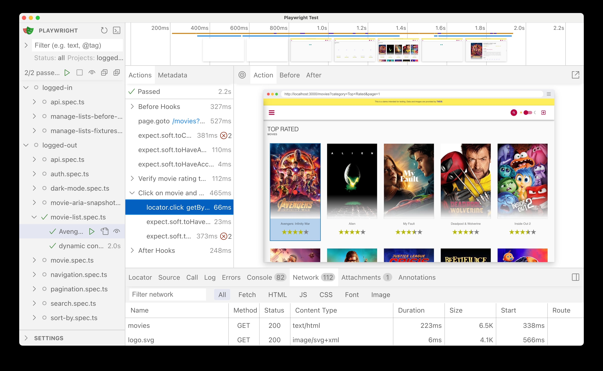

# 04 Debugging with UI Mode and traces

## Goal

Debug interactively in UI Mode, use Copy Prompt with a coding agent, and open a trace for post-mortem analysis.

## Read first

- [UI Mode](https://playwright.dev/docs/test-ui-mode)
- [Trace Viewer](https://playwright.dev/docs/trace-viewer)
- [AI testing guide](/docs/AI-TESTING) (heal policy and traces)

## UI Mode



```bash
npx playwright test --ui
```

Filter projects in the sidebar (`chromium`, `logged-in chrome`, etc.). Run one test, click actions in the timeline, and time-travel through page snapshots.

Break an assertion on purpose, open the **Errors** tab, and use **Copy Prompt** with your coding agent. Fix from evidence, then revert the intentional breakage.

## Traces

Config sets `trace: 'on-first-retry'`. Force a trace locally:

```bash
npx playwright test tests/logged-out/search.spec.ts --project=chromium --trace on
```

Open the result:

```bash
npx playwright show-trace test-results/.../trace.zip
# or
npx playwright trace open path/to/trace.zip
npx playwright trace actions
```

Heal using trace or snapshot evidence, not blind locator retries.

## Key takeaways

- You can step through a test in UI Mode.
- You have used Copy Prompt or a trace at least once.
- You will not change locators without looking at a snapshot or trace first.

Next: [05 Tags](/05-tags-annotations) or jump using the [course home](/course).
